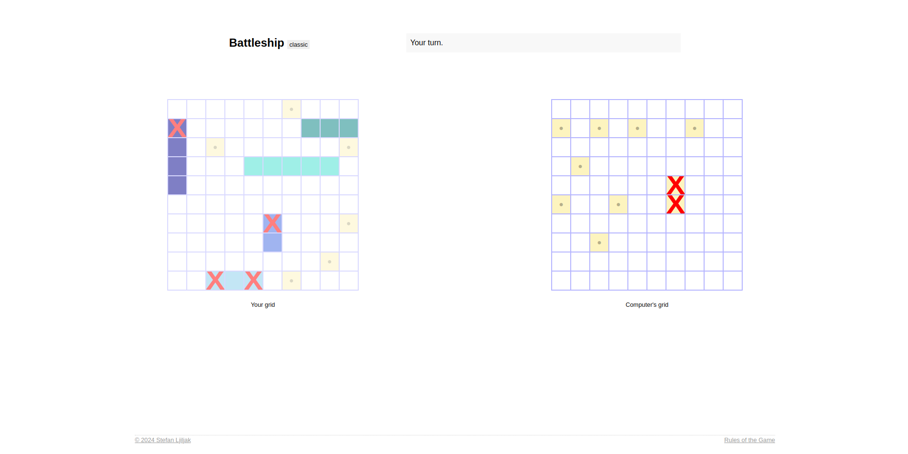

# JavaScript Battleship Game

This [project](https://www.theodinproject.com/lessons/node-path-javascript-battleship) is a simple implementation of the classic [Battleship game](<https://en.wikipedia.org/wiki/Battleship_(game)#Description>) using JavaScript. It includes features such as ship placement, drag and drop functionality, turn-based gameplay, and a grid-based interface. The app is built with modern JavaScript tools and follows a modular design approach.



## Live Demo

You can try the game live by visiting the following URL:
[JavaScript Battleship Game](https://1bewildered-bit.surge.sh/)

## Features

- **Interactive Gameplay**: Play a classic Battleship game against an opponent.
- **Grid-Based UI**: Visual representation of the board with interactive elements.
- **Turn-Based System**: Players take turns to attack enemy ships.
- **Webpack Setup**: Efficient bundling and resource management.
- **Testing with Jest**: Unit tests to ensure the reliability of game logic.

---

## Installation and Setup

Follow these steps to set up the project:

### Prerequisites

Ensure you have the following installed on your system:

- **Node.js**: [Download here](https://nodejs.org/)
- **npm**: Comes bundled with Node.js.

### Clone the Repository

```bash
git clone <repository_url>
cd javascript-battleship-game
```

### Install Dependencies

`npm install`

### Building the Project

`npm run build`

### Running Tests

`npm test`

### Running the Application

To run the application in development mode, you may need to set up a development server manually or once the build is complete, you can open the dist/index.html in your browser to view the game.

### License

This project is licensed under the GPL-3.0 license. For more details about the terms and conditions of this license, refer to the official documentation: [GPL-3.0 License](https://www.gnu.org/licenses/gpl-3.0.en.html).

### Author

Created by : [Stefan Ljiljak](https://github.com/baplaninarenje). Feel free to reach out for any suggestions or questions!
